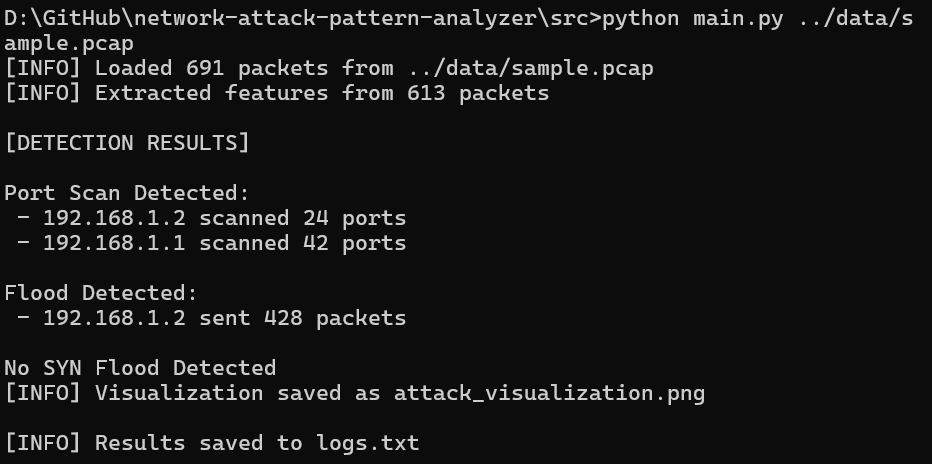
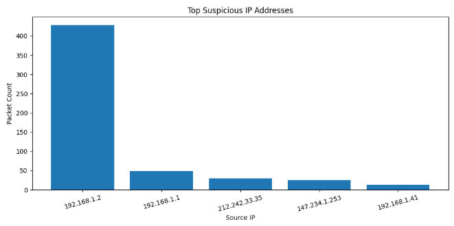

# Network Attack Pattern Analyzer

A Python-based cybersecurity project that analyzes PCAP network traffic and detects suspicious attack patterns such as port scanning, traffic flooding, and SYN flood attacks.

---

## Features

- PCAP file analysis using Scapy
- Network packet feature extraction
- Port scan detection
- Traffic flood detection
- SYN flood attack detection
- CLI-based execution
- Timestamped logging system
- Attack visualization using Matplotlib

---

## Project Structure

```bash
network-attack-pattern-analyzer/
│
├── data/
│   └── sample.pcap
│
├── outputs/
│   ├── logs.txt
│   └── attack_visualization.png
│
├── screenshots/
│   ├── run_output.png
│   ├── graph_output.png
│
├── src/
│   ├── analyzer.py
│   ├── capture.py
│   ├── detection.py
│   ├── features.py
│   ├── main.py
│   └── visualizer.py
│
├── .gitignore
├── LICENSE
├── README.md
└── requirements.txt
```

---

## Technologies Used

- Python
- Scapy
- Matplotlib
- Git & GitHub

---

## Detection Capabilities

### 1. Port Scan Detection

Detects suspicious IP addresses scanning multiple ports within network traffic.

### 2. Traffic Flood Detection

Identifies IP addresses generating unusually high packet traffic.

### 3. SYN Flood Detection

Detects excessive TCP SYN packets that may indicate denial-of-service attempts.

---

## Installation

Clone the repository:

```bash
git clone https://github.com/husna-fathima-713/network-attack-pattern-analyzer.git
```

Move into the project directory:

```bash
cd network-attack-pattern-analyzer
```

Install dependencies:

```bash
pip install -r requirements.txt
```

---

## Usage

Move into the `src` directory:

```bash
cd src
```

Run the analyzer:

```bash
python main.py ../data/sample.pcap
```

---

## Sample Output

```text
[INFO] Loaded 691 packets from ../data/sample.pcap

[DETECTION RESULTS]

No Port Scan Detected

Flood Detected:
 - 192.168.1.5 sent 145 packets

No SYN Flood Detected

[INFO] Results saved to logs.txt
[INFO] Visualization saved as attack_visualization.png
```

---

## Screenshots

### Project Execution



---

### Attack Visualization



---

## Output Logging

All analysis results are stored inside:

```text
outputs/logs.txt
```

---

## Future Improvements

- Real-time packet sniffing
- Machine learning-based anomaly detection
- Threat intelligence integration
- SIEM integration
- Web dashboard visualization

---

## Author

HF

---

## License

This project is licensed under the MIT License.